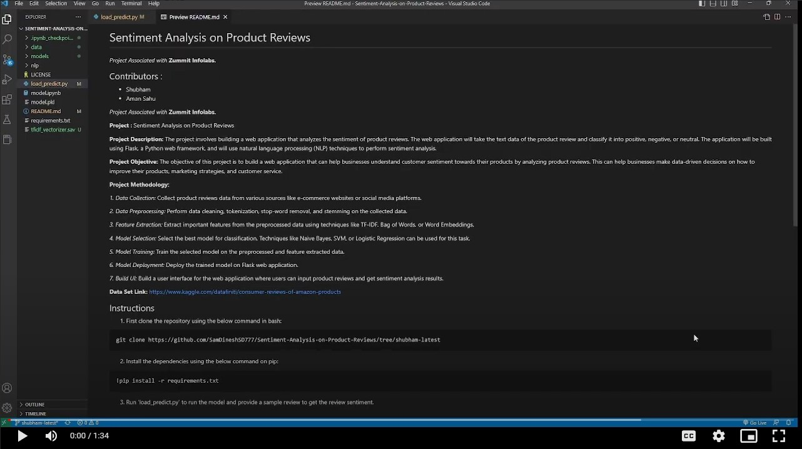

# Sentiment Analysis on Product Reviews
*Project Associated with* **Zummit Infolabs.**

## Contributors :
* Shubham
* Aman Sahu

*Project Associated with* **Zummit Infolabs.**

**Project :** Sentiment Analysis on Product Reviews

**Project Description:**
The project involves building a web application that analyzes the sentiment of product reviews. The web application will take the text data of the product review and classify it into positive, negative, or neutral. The application will be built using Flask, a Python web framework, and will use natural language processing (NLP) techniques to perform sentiment analysis.

**Project Objective:**
The objective of this project is to build a web application that can help businesses understand customer sentiment towards their products by analyzing product reviews. This can help businesses make data-driven decisions on how to improve their products, marketing strategies, and customer service.

**Project Methodology:**

*1. Data Collection:* Collect product reviews data from various sources like e-commerce websites or social media platforms.

*2. Data Preprocessing:* Perform data cleaning, tokenization, stop-word removal, and stemming on the collected data.

*3. Feature Extraction:* Extract important features from the preprocessed data using techniques like TF-IDF, Bag of Words, or Word Embeddings.

*4. Model Selection:* Select the best model for classification. Techniques like Naive Bayes, SVM, or Logistic Regression can be used for this task.

*5. Model Training:* Train the selected model on the preprocessed and feature extracted data.

*6. Model Deployment:* Deploy the trained model on Flask web application.

*7. Build UI:* Build a user interface for the web application where users can input product reviews and get sentiment analysis results.

**Data Set Link:**
https://www.kaggle.com/datafiniti/consumer-reviews-of-amazon-products

## Instructions
1. First clone the repository using the below command in bash:
```git
git clone https://github.com/SamDineshSD777/Sentiment-Analysis-on-Product-Reviews/tree/shubham-latest
```

2. Install the dependencies using the below command on pip:
```pip
!pip install -r requirements.txt
```

3. Run 'load_predict.py' to run the model and provide a sample review to get the review sentiment.

## Demo
**Click to play the demo**    
[](https://drive.google.com/file/d/1xOfDIN0nDi6G8pHYYz8Hol-mXCtMP5Ee/view?usp=sharing)